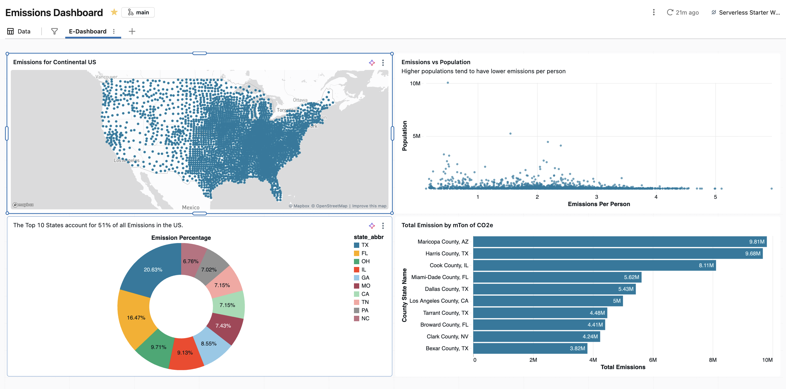

# Emissions & Environmental Impact Analysis

A data-driven dashboard visualizing CO2e emissions across the United States. This project demonstrates a complete end-to-end data engineering workflow, transforming raw S3 environmental data into an interactive AI/BI dashboard within Databricks.

## 📊 Key Insights
* **Geographic Concentration:** The top 10 states account for 51% of all emissions in the US, highlighting the importance of state-level environmental policy.
* **Population Efficiency:** Analysis reveals an inverse relationship between population and emissions per person; higher population centers tend to be more efficient in per-capita emissions.
* **High-Impact Regions:** Maricopa County, AZ, and Harris County, TX, emerge as top contributors, serving as key focus areas for targeted carbon reduction initiatives.

## 🛠 Tech Stack
* **Analytics Platform:** Databricks (AI/BI Dashboards)
* **Data Integration:** Fivetran (Automated ELT)
* **Storage:** AWS S3 (Raw Data)
* **Version Control:** Git integration via Databricks Repos

## 📂 Project Structure
This project follows a "Source of Truth" methodology to ensure reproducibility:
* `/data_logic`: Contains the version-controlled SQL logic used to define the datasets powering the dashboard.
* `/Dashboard`: Contains the `.lvdash.json` definition file, enabling the dashboard layout to be restored or deployed programmatically.

## 🚀 How to Reproduce
1. **Data Pipeline:** Ensure your AWS S3 bucket is connected to your Databricks Catalog via your Fivetran connector.
2. **Logic Restoration:** Run the SQL queries provided in `/data_logic` within your Databricks SQL Editor to recreate the base datasets.
3. **UI Restoration:** Import the `.lvdash.json` file from `/Dashboard` into your Databricks AI/BI Dashboard interface to restore the visual layout.